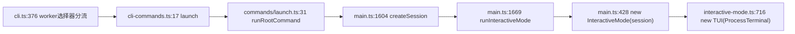

调研主题：agent 运行时与 UI 的进程解耦
仓库：C:/Users/zero/Desktop/code/github/oh-my-pi
日期：2026-08-06

# oh-my-pi · agent 运行时与 UI 的进程解耦程度

**结论先行：oh-my-pi 没有把运行时做成可被多个 UI 连接的服务。每次 `omp` 启动的都是一个自包含进程，TUI、agent 循环、所有子 agent、工具执行全在同一个 Bun 进程、同一张对象图里。** 仓里确实存在多个 IPC/daemon 层（worker 重入、daemon broker、LSP mux、auth broker、collab relay），但它们分别管的是「外部被启动的进程」「语言服务器」「凭据」「会话镜像」——**没有一层管 agent runtime 本身**。唯一接近「多 UI 连同一个 agent」的是 collab，但那是 host 进程向 relay 广播、guest 端重建本地 replica，不是瘦客户端。

---

## 1. 是否有 server/daemon 层：进程模型与入口坐标

**单进程，TUI 直调运行时。**

调用链：

- 进程入口 `packages/coding-agent/src/cli.ts:56`（`isProcessEntry`）、`:376-394`（worker 选择器先分流，然后才加载正常命令图）。
- `packages/coding-agent/src/main.ts:1604-1608` 在**本进程**构造 `AgentSession`；`:1669-1712` 分派到 interactive / rpc / print。
- `packages/coding-agent/src/main.ts:428-436` 把同一个 `session` 对象直接交给 `InteractiveMode`；`packages/coding-agent/src/modes/interactive-mode.ts:435-436,682` 持有 `session: AgentSession` 字段，`:716` 在同一进程里 `new TUI(new ProcessTerminal(), …)`。TUI 与 runtime 之间没有任何序列化边界。
- 事件订阅是直接函数回调，不是流：`packages/coding-agent/src/modes/controllers/event-controller.ts:428-430` `this.ctx.session.subscribe(async event => this.handleEvent(event))`。
- **子 agent 也在同进程**：`packages/coding-agent/src/task/executor.ts:2525-2528` 注释写死 "Run a single agent in-process."（函数名 `runSubprocess` 是历史遗留，见第 6 节）。
- 支撑跨 agent 协作的两个注册表都是 **process-global 单例**，天然不跨进程：`packages/coding-agent/src/registry/agent-registry.ts:1-10,66-72`、`packages/coding-agent/src/irc/bus.ts:1-2,50-57`。

**没有 `omp serve` 之类的命令**：全部子命令列表见 `packages/coding-agent/src/cli-commands.ts:17-184`；里面的 `auth-broker` / `auth-gateway` / `browser-relay` 是凭据与浏览器服务，`join` 是 collab guest（仍走完整 `runRootCommand`，见 `packages/coding-agent/src/commands/join.ts:36-37`）。

---

## 2. 传输与协议：本仓存在的 4 条 IPC 通道

| 通道 | 传输 | 序列化 | 谁在两端 | 坐标 |
| --- | --- | --- | --- | --- |
| worker 重入 | Worker thread `postMessage` / 子进程 `process.send` | 结构化克隆 | 同一二进制的两个执行体 | `cli.ts:29,125-131,376-380`；`cli.ts:263-311`（IPC transport） |
| daemon broker | Unix socket / Windows named pipe | 换行分隔 JSON + 每请求 bearer token | omp 进程 ↔ 项目级 broker | `launch/paths.ts:7-13`；`launch/broker.ts:385-420`；`launch/protocol.ts:126-136` |
| LSP mux | Unix socket / named pipe | Content-Length 帧的 LSP JSON-RPC | 所有 omp 进程 ↔ 项目级 mux | `lsp/mux/protocol.ts:1-11,34-40` |
| collab | WebSocket（外部 relay） | AES-256-GCM 密封的 JSON 帧 + 4 字节 peerId 前缀 | host omp ↔ guest omp/浏览器 | `collab/protocol.ts:1-8,108-125` |

细节与取舍：

- **worker 重入同一入口**（ZCode 已采用的契约）：隐藏 argv 选择器 `__omp_worker_*`，在第一个 `await` 之前同步分流，因为 Bun 会在 entry 模块顶层求值结束时冲刷父进程预投递的消息 —— 晚一步就丢首条消息（`cli.ts:145-155` 的注释是这条边界条件的唯一记录）。
- **daemon broker 协议**是 typed op/result 联合 + 手写 validator，不用 schema 库：op 集合 `launch/protocol.ts:71-92`，result 集合 `:95-124`，请求信封含 `token` `owners` `completionAcks` 等 `:126-136`。除了 request/response，还有**服务端主动推送**的 `daemon-completed` 通知（`:139-146`）。
- **LSP mux 是本仓唯一把"贵的运行时组件"抽成跨进程共享服务的例子**：一次 `omp/muxConnect` 握手把链路绑到一个共享 server 实例，之后就是普通 LSP 流量（`lsp/mux/protocol.ts:47-53`）。**任何失败都降级为 `null` → 调用方回退到进程内 spawn**（`lsp/mux/daemon.ts:8-10`）。默认开启：`lsp.shared` 默认 `true`（`docs/settings.md:567`）。
- **auth broker** 是唯一的 HTTP 服务：`packages/ai/src/auth-broker/server.ts:660`（`Bun.serve`），带 SSE 快照流（`:1-11` 文件头 + `docs/auth-broker-gateway.md:3-8,42`）。它跨机器，不是本机 IPC。

**事件流形状：增量 event 为主 + 按需/去抖的全量快照。**

- 增量事件类型定义：`session/agent-session-events.ts:12-64`。
- RPC 里快照是**显式命令**，不是自动推送：`get_state`（`modes/rpc/rpc-types.ts:41`）、`get_messages_page`（`:89`，分页）。
- collab 是三段式：`welcome` 元数据 + `snapshot-chunk` 分片全量 → `entry`/`event` 增量 → `state` **100ms 去抖的页脚快照**（`collab/host.ts:60-62`：`STATE_DEBOUNCE_MS=100`、`AGENTS_DEBOUNCE_MS=100`、流式期间额外 `STREAMING_STATE_INTERVAL_MS=2000` 兜底）。

---

## 3. 会话与状态归属

**全部在 client 进程，server 侧零 session 状态。**

- session 是一个 JSONL 文件：一行 header + 若干 entry，entry 按 `(id, parentId)` 成树，可变叶指针选出活跃分支（`session/session-manager.ts:404-407`）。文件名 `<timestamp>_<id>.jsonl`（`:1058-1059`）。
- 热路径写入优先走 `appendSync`，**为的是让写失败在调用返回前就 latch 住**，因为 turn 循环不 try/catch（`session/session-manager.ts:928-944`）。无 `fsync`（`session/session-storage.ts:16-25`）。
- 存储后端是可插拔接口（file / memory / redis / SQL indexed），`session/session-storage.ts:56-92`；默认 `FileSessionStorage`（`session-manager.ts:2422`）。
- **没有 attach 语义**。`--resume` / `--continue` 是重新读 JSONL 在新进程里重建 session：`main.ts:1476`（`SessionManager.open(selected.path)`）。断线重连不存在，因为没有连接。

`history://` / `agent://` **不是跨进程资源**：

- `internal-urls/history-protocol.ts:56-66` 先查本进程 `AgentRegistry.global()`；`:90-101` 命中才读 live messages。
- 未命中才降级为**磁盘扫描**（`:8-14` 文件头 + `:82-87`），扫的是本 session 的 artifacts 目录。
- `internal-urls/agent-protocol.ts:50-53` 更直接：`artifactsDirsFromRegistry()`，`dirs.length === 0` 就报 "No session - agent outputs unavailable"。

collab guest 端把 host 的 transcript 抄成**本地 replica 文件** `~/.omp/collab/<roomId>.jsonl`（`docs/collab.md` 架构注 2），guest 用普通 `/resume` 机制加载（`collab/guest.ts:1-17`），所以 `/dump`、上下文估算在 guest 端是原生工作的 —— 代价是 guest 不是瘦客户端。

---

## 4. UI 启动路径与冷启动成本

**冷启动是一条几乎全串行的阻塞链，TUI 在最后才出现。** 按 `main.ts` 顺序：

| 阶段 | 坐标 | 阻塞性质 |
| --- | --- | --- |
| plugin roots 预载（并发发起，后面 await） | `main.ts:1224-1230` | 磁盘扫描 `~/.claude/plugins` + `~/.omp/plugins` + 项目注册表 |
| 读管道 stdin（非协议模式） | `main.ts:1214` | 可能无限等，1s 后打印提示 |
| `discoverAuthStorage` + `new ModelRegistry` | `main.ts:1246-1248` | 开 SQLite |
| `Settings.init` | `main.ts:1250-1252` | 分层配置（项目/全局/`--config` overlay） |
| `initTheme` | `main.ts:1284-1292` | 装 SIGWINCH / macOS 外观监听 |
| `resolveModelScope` | `main.ts:1294-1300` | 模型解析 |
| session 解析 / picker | `main.ts:1310-1476` | 可能列全盘 session |
| `createAgentSession` | `main.ts:1604-1608` | 见下 |
| `runInteractiveMode` → `new TUI` | `main.ts:1714` → `interactive-mode.ts:716` | 终于建 TUI |

`createAgentSession` 内部是本仓唯一做过明确并行化的地方（`sdk.ts:1282-1338`）：workspace tree、context files、active repo context、watchdog、advisor、prompt templates、slash commands、skills 全部**先发起后 await**，最后 `Promise.all` 汇合（`sdk.ts:1617-1623`）。

**具体的"秒开"设计只有三处：**

1. **模型目录同步读 SQLite 缓存，网络刷新推迟到 session 建好之后。** `config/model-registry.ts:862-899`（构造器同步 `#loadModels()`）→ `:1312-1321`（`readModelCache(..., 24h TTL, cacheDbPath)`）；后台刷新在 `main.ts:1519-1521` 才 kick，且注释明说"与 createAgentSession 的并行臂并发会争事件循环、把每条臂拉长约 30ms"。
2. **5 秒启动扫描死线**：`sdk.ts:1282` `STARTUP_SCAN_DEADLINE_MS = 5000`，`:1599-1614` `raceWithDeadline` 超时返回 `undefined` 但**让后台工作继续跑以暖 cache**。
3. **懒加载分支模块**：setup wizard（`main.ts:444-447`）、ACP runner（`:1534`）、RPC runner（`:1666`）、print runner（`:1714`）、export/html（`:1167`）都是 `await import(...)`，注释一律写"keep X code out of normal interactive startup"。

**所有缓存都是进程内的，跨进程不复用：**

- `capability/fs.ts:4-5`：`contentCache` / `dirCache` 两个裸 `Map`，**无 TTL、无容量上限**，只能整体 `clearCache()`（`:104-107`）。
- `discovery/helpers.ts:886,909-911`：`pluginRootsCache` 同样是进程内 `Map`，key = `home:projectRegistry:activeProject`。
- Rust 侧确实有共享 fs scan cache（`docs/fs-scan-cache-architecture.md`），但 **TTL 1000ms、上限 16 条**，是为单次会话内重复扫描服务的，对冷启动无用。

**上游自己承认启动慢**：`main.ts:200-236` 有一整套 startup watchdog —— 每 10 秒往 stderr 打印"卡在哪个 phase"，因为"零输出的无限挂起"是真实发生过的故障模式；另有 `PI_TIMING`（分层耗时树）与 `PI_DEBUG_STARTUP`（同步 phase 标记，能在硬挂起时存活）两套工具，见 `docs/environment-variables.md:405-406`。**他们把冷启动当可观测性问题处理，而不是架构问题。**

编译产物是单文件 Bun compile（`scripts/compile-binary.ts:36-57`），**未启用 `--bytecode`**；`cli.ts:434-437` 的注释说明他们知道 bytecode 与顶层 `await` 冲突。

---

## 5. SDK / RPC 对外形态

三条对外路径，**共用同一个 `createAgentSession` 与同一个 `AgentSession`**，差异只在 mode runner 与 host 默认设置：

- **SDK（进程内库）**：`sdk.ts` 导出 `createAgentSession`。`docs/sdk.md:3-5` 原话："The SDK is the in-process integration surface… If you need cross-language/process isolation, use RPC mode instead."
- **RPC（stdio JSONL）**：`modes/rpc/rpc-mode.ts:1-13`（协议说明）、`docs/rpc.md:3-6`。启动方式 `omp --mode rpc`（`docs/rpc.md:19`），**client 库自己 spawn 这个子进程**（`docs/rpc.md` 末段：`RpcClient` 默认 `omp --mode rpc`，可传 `command=[...]`）。**一个 client 一个进程**。
- **ACP（另一条 stdio 协议）**：`main.ts:1530-1536`，用工厂 `createAcpSessionFactory` 支持一个进程里多个 top-level session（`main.ts:1600-1602` 的注释明确说 ACP 会有多个并发顶层 session，所以不能装 process-global 的 reviver factory）。

分派点集中在 `main.ts:1516-1523`（`createSession` 闭包）与 `:1665-1715`（三分支），host 默认设置差异表在 `main.ts:131-176`（`HOST_DEFAULTED_SETTING_PATHS`）与 `:178-183`（RPC 额外的 background 默认）。这是本仓**最值得直接搬的结构**。

RPC 传输的两个硬性上限：单物理帧 1 MiB、v2 重组上限 64 MiB（`modes/rpc/rpc-frame.ts:5-8`），协商靠 ready 帧广播 + `negotiate_protocol` 命令（`docs/rpc.md:41-56`）。

---

## 6. 代价与教训（源码/文档里能直接看到的）

### 6.1 daemon 生命周期的真实复杂度（broker 是最完整样本）

管一个**只负责外部进程**的 daemon，已经付出了：

- **单实例锁**：`O_EXCL` 写 PID 文件当 lease，含 instanceId 防误删（`launch/broker.ts:288-330`）。
- **共享 token 的创建竞争**：`launch/client.ts:77-104`，最多 100 轮"读→`wx` 创建→读"重试，失败就报"Timed out initializing daemon broker token"。
- **presence 目录 + `process.kill(pid, 0)` 探活**：每个 omp 进程在 `clients/<pid>-<uuid>.json` 注册，退出时删；broker 靠扫这个目录决定是否还有活客户端（`launch/presence.ts:23-79`）。
- **崩溃恢复要重写别人的状态**：上任 broker 死掉后，它的非 detached 子进程都死了，新 broker 必须把这些记录标成 `exited`，同时**保留已终止记录的真实 `exitedAt` 以维持排序**（`launch/broker.ts:139-154`、`:1209-1228`）。
- **`list` 响应必须有界**：终止态 daemon 只列最近 10 条（`launch/broker.ts:38-43` `MAX_TERMINAL_DAEMONS_LISTED = 10`，引用 issue #6517）。
- **进程退出钩子**：`postmortem.register` 两处（`broker.ts:1361`、`presence.ts:42`）。

### 6.2 权限/交互跨进程转发的形状（collab 是唯一样本）

host 的 `select`/`editor` 询问要**广播给所有可写 guest，第一个提交或取消的应答定胜负，其余用 `ui-request-end` 撤销**（`collab/host.ts:174-194`、`:460-467`，`docs/collab.md` guest 权限段）。写权限本身靠 16 字节 write token 的 **timing-safe 比较**（`collab/host.ts:358-365`）。这就是"审批要跨进程转发"的真实代价形状。

### 6.3 大 payload 是跨进程方案的头号成本

- RPC：超限帧先尝试 compact（去掉已流式发过的 message），再走 **7 级递进 shrink**（字符串 256KB→64B、数组 512→1、对象 512→8，`rpc-frame.ts:29-36`），最后才 chunk 分片（`:88-113`，每片 256KB base64）。
- collab：快照按 **512KB 软上限**分片，理由写得很实在——"第一 MB 经默认 relay 约需 3s，512KB 稳落在 guest 的 30s 逐块超时内"（`collab/host.ts:107-113`）；guest 侧 `WELCOME_TIMEOUT_MS = 30_000`、`SNAPSHOT_PROGRESS_TIMEOUT_MS = 30_000`（每块重置），依据是"默认 relay 持续约 350 KB/s"（`collab/guest.ts:56-68`）。

### 6.4 版本兼容：两种策略并存

- broker 用**可选字段软兼容**：`renderTerminalRows?` 注释直言 "absent preserves legacy raw-text responses"（`launch/protocol.ts:82-83`）——常驻 daemon 必然遇到「新客户端 + 旧 daemon」。
- collab 用**版本号硬拒**：`proto !== COLLAB_PROTO` 直接回 error 帧（`collab/host.ts:371-376`）。

### 6.5 跨进程共享必须可降级

LSP mux 的整个设计前提是"随时可以不用"：任何失败返回 `null` 让调用方回退进程内 spawn（`lsp/mux/daemon.ts:8-10`），ensure 循环只试 3 轮（`:39-40`），连接 3s / 握手 10s / 探活 1.5s / 就绪 15s 四个独立超时（`:35-38`）。

---

## 7. 给 Rust 实现的可移植结论

### 7.1 可以直接抄

| 做法 | 为什么 | 坐标 |
| --- | --- | --- |
| 一个 session 工厂喂多个 mode runner，差异只在 host 默认设置 | 避免 TUI/RPC/print 三套 runtime 分叉 | `main.ts:1516-1523,1665-1715`；默认覆盖表 `:131-176` |
| worker 用 argv 选择器重入同一二进制 | ZCode 已有此契约，此处只是确认上游边界条件 | `cli.ts:376-380`；首消息丢失的坑见 `cli.ts:145-155` |
| 只把「贵且天然可共享」的组件做成 daemon，**且必须可降级** | LSP server 启动几秒且状态可共享；agent runtime 两者都不满足 | `lsp/mux/daemon.ts:1-11,35-40` |
| 模型目录：同步读本地缓存开局，网络刷新推到 session 建好之后 | 唯一真正生效的冷启动优化 | `model-registry.ts:862-899,1312-1321`；`main.ts:1519-1521` |
| 启动扫描并行 + 死线截断、超时后台继续暖 cache | 慢磁盘/大仓不阻塞开局 | `sdk.ts:1282,1599-1623` |
| 增量 event 为主，全量快照只在 join/显式请求时发 | 见第 2 节 | `agent-session-events.ts:12-64`；`rpc-types.ts:41,89`；`collab/host.ts:60-62` |

### 7.2 TS→Rust 的语义落差（最重要的一节）

- **「HTTP/socket server 很便宜」在 Rust 里同样成立，但「把 session 状态送过去」不成立。** oh-my-pi 能把 `SessionEntry` / `AgentSessionEvent` / `Model` 直接 `JSON.stringify` 丢上线，是因为它们本来就是 GC 管的 plain object。ZCode 若要做 daemon，必须先给整棵事件/条目树定义 **serde wire 契约**并决定 owned vs borrowed —— 这是把运行时拆出去的**真实首付**，不是可以推后的细节。参照 `collab/protocol.ts:60-104`（host 侧富类型序列化成 `@oh-my-pi/pi-wire` 的 JSON 骨架）与 `packages/wire/src/index.ts` 的分层：**wire 类型必须独立于 runtime 类型**。
- **进程退出清理**：`postmortem.register`（`broker.ts:1361`、`presence.ts:42`）在 Rust 里没有对应物。lease 文件、presence 文件、socket 文件的清理要显式 Drop guard + 信号处理，且 Drop 在 `SIGKILL` 下不跑 —— oh-my-pi 正是靠 `process.kill(pid, 0)` 探活来兜住这个洞（`presence.ts:70-76`），Rust 里要照抄这个兜底。
- **Windows 命名管道没有文件权限模型**：oh-my-pi 的鉴权是「`0o600` token 文件 + 每请求 bearer」（`client.ts:90`、`protocol.ts:127`），unix socket 侧靠目录 `0o700`（`presence.ts:31`）。Windows 上 `\\.\pipe\omp-daemon-<wyhash>`（`paths.ts:8-11`）默认任何本地用户可连，**token 文件是唯一防线**。Rust 里用 `tokio::net::windows::named_pipe` 要自己设 SecurityDescriptor，或照抄 token 方案。
- **`Bun.spawn` 的 detached 语义 ≠ Rust 的 `process_group`**：broker 的 spawn 选项被抽成 `launch/spawn-options.ts` 并按 `platform` + `hostHasInheritableConsole()` 分叉（`broker.ts:50-53`）—— 说明这块平台差异大到值得单独一个模块。

### 7.3 边界条件清单（移植时最容易整批丢掉的）

1. worker 首消息必须在第一个 `await` 之前装 handler，否则丢（`cli.ts:145-155`）。
2. broker token 文件的创建竞争：`wx` + 重试，不能 `writeFile`（`client.ts:81-103`）。
3. broker lease 必须含 instanceId，释放前校验，否则会删掉接任者的 lease（`broker.ts:321-330`）。
4. 恢复上任 broker 的记录时，已终止记录保留原 `exitedAt`，仅存活记录标 exited（`broker.ts:139-154`）。
5. 日志读取必须排在写队列后面，且读失败不能毒化写队列（`broker.ts:223-234` 的双 `.then(() => undefined)`）。
6. 大帧路径：先 compact（扣掉已流式发过的部分）→ 再 shrink → 再分片；分片序列不允许交错、必须从 index 0 开始、字节数必须严格匹配（`rpc-frame.ts:131-183`）。
7. 快照分片的超时应是**逐块重置**，不是总时长（`guest.ts:60-68`）。
8. 权限询问广播后，第一个应答定胜负 + 显式撤销其余（`host.ts:460-467`）。
9. 跨进程共享组件的每一步都要独立超时（连接/握手/探活/就绪），且总重试轮数有界（`lsp/mux/daemon.ts:35-40`）。

### 7.4 不要抄

| 不要抄 | 理由 | 坐标 |
| --- | --- | --- |
| `runSubprocess` 这个函数名 | 它是 in-process 的，名字直接骗人；`subprocessToolRegistry`、`SubprocessToolEvent` 一整套命名都被这个错误名字污染了 | `task/executor.ts:2525-2528` vs `task/subprocess-tool-registry.ts:1-12` |
| token 竞争用 100×50ms 轮询 | 在慢盘/高竞争下是 5 秒的静默阻塞；Rust 里用文件锁或一次性 `create_new` + 失败即读 | `launch/client.ts:81-103` |
| `capability/fs.ts` 的进程内 fs cache | 无 TTL、无上限、只能整体 clear；长会话里会持有过期目录项，且没有任何失效信号 | `capability/fs.ts:4-5,104-107` |
| 把 `history://` 的"注册表未命中就扫磁盘"当跨进程方案 | 它是同进程注册表的兜底，不是设计过的跨进程查询；扫描范围只覆盖本 session 的 artifacts 目录 | `internal-urls/history-protocol.ts:8-14,82-87` |

---

## 悬而未决

- **未测实际冷启动毫秒数**。仓里有 `PI_TIMING` / `PI_DEBUG_STARTUP` 工具（`docs/environment-variables.md:405-406`），但没有跑（任务要求只读、不执行）。`sdk.ts:1287` 注释提到的"每条并行臂约 30ms"是唯一的量化数据点。
- **未读 `packages/collab-web`**（浏览器 guest 客户端）与 relay 服务端（Go，不在本仓，`docs/collab.md` 自陈"a small content-blind Go service"）。因此"浏览器 UI 秒开"这条路径的客户端成本无从判断。
- **没有找到任何针对"UI 秒开"的专项设计文档或架构决策记录**。搜索路径：`docs/**/*.md` 全文 grep `daemon|broker|single instance|cold start|startup time`，命中全是 auth-broker / LSP mux / launch broker，无一条是关于 agent runtime 常驻化的。这本身是一条结论：**上游从未把"agent runtime 常驻 + 瘦 UI"当作候选方案**。
- **与 ZCode 既有契约的冲突：无。** worker 重入 CLI 入口（`rule://zcode-architecture`）与本仓 `cli.ts:376-380` 一致，本次调研未发现需要推翻 `plans/tui/` 或既定契约的地方。
