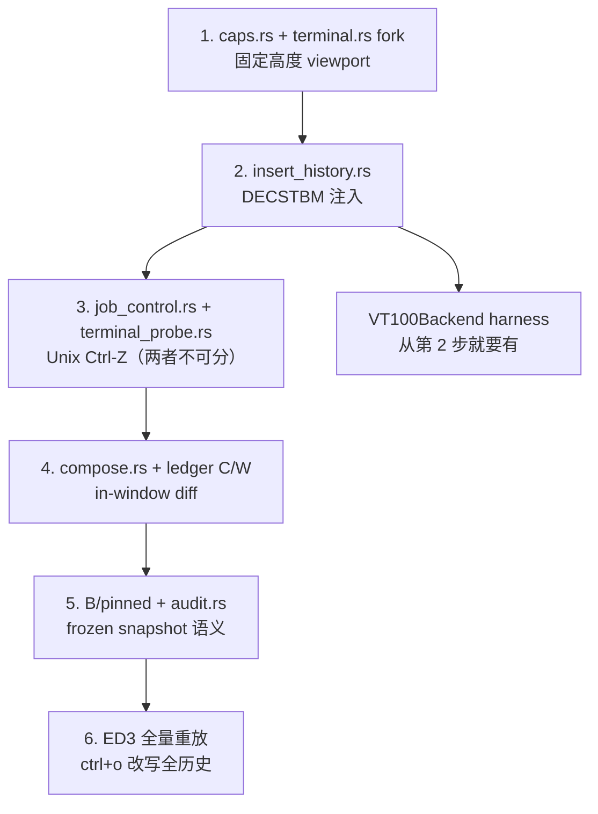

# 自研模块清单

## 文件结构

```
src/tui/
  mod.rs
  caps.rs             # 能力探测 + Windows VT 启用       [#cfg(windows) 分支]
  terminal.rs         # fork ratatui::Terminal
  insert_history.rs   # DECSTBM 历史注入 + per-batch 模式选择
  compose.rs          # segment 账本 + stable prefix
  ledger.rs           # C/W/B 账本
  audit.rs            # committed-prefix 审计与 resync
  emit.rs             # 四条发射路径
  job_control.rs      # Ctrl-Z suspend                  [整个模块 #cfg(unix)]
  terminal_probe.rs   # CSI 6n 光标位置探测              [整个模块 #cfg(unix)]
tests/
  vt_backend.rs       # VT100Backend
  shadow.rs           # shadow commit ledger
```

## 模块表

| 模块 | 抄源 | 抄什么 | 行数 | 平台 |
|---|---|---|---|---|
| `terminal.rs` | `codex-rs/tui/src/custom_terminal.rs`(1160 行) | fork `ratatui::Terminal`。改动:viewport 改为可变 `Rect`、暴露 `backend_mut()` / `set_viewport_area()` / `note_history_rows_inserted()` / **`clear_after_position()`**(ZellijRaw 路径必需)、去掉 `Viewport` 枚举 | ~800 | 全 |
| `insert_history.rs` | `codex-rs/tui/src/insert_history.rs`(全文 1071 行) | **两条路径都要**:`Standard`(`:194-246`)DECSTBM 三段式 + `:196-215` 的 `\x1bM`(RI)反向推 viewport;`ZellijRaw`(`:164-193`)清 viewport + 同帧完整替换 + 预留空行;`tui.rs:908-913` 的 per-batch 模式选择;两种 `HistoryLineWrapPolicy` | ~250 | 全 |
| `caps.rs` | `codex-rs/tui/src/tui.rs:1137-1177` | `ensure_virtual_terminal_processing`。**改进**:施加与判定分离,回读 `GetConsoleMode` 确认 bit | ~120 | win 分支 |
| `job_control.rs` | `codex-rs/tui/src/tui/job_control.rs`(211 行) + `tui.rs:339-348, 376-382` | `SuspendContext`、`libc::kill(0, SIGTSTP)`、`reapply_raw_mode_after_resume`、resume 后 `cursor_position` 重锚定、`tcflush` | ~210 | unix only |
| `terminal_probe.rs` | `codex-rs/tui/src/terminal_probe.rs:62-244`(全文 966 行) | **仅 `cursor_position` 路径**:`Tty`(dup stdin/stdout,失败回退 `/dev/tty`)、`poll_readable`(`libc::poll`)、`read_until`、`parse_cursor_position`。不要 startup probe 与 OSC 10/11 | ~250 | unix only |
| `compose.rs` | `oh-my-pi/packages/tui/src/tui.ts:1195-1309` | segment 账本 `{component, start, rowCount, lines}`;未变段直接复用,只重新 ingest stable prefix 之后的行 | ~200 | 全 |
| `ledger.rs` | `oh-my-pi/docs/tui-core-renderer.md:41-58` + `tui.ts:3049-3153` | C/W/B 三量;`W = max(C, L-h)`;commit end = `max(C, W)`;pinned 时 clamp 到 B(`tui.ts:3093`) | ~300 | 全 |
| `audit.rs` | `oh-my-pi/packages/tui/src/tui.ts:3264-3276` + `findCommittedPrefixResync` | 三区语义;exact 区参与审计、frozen 区豁免;违规则 re-anchor 让后续行重新提交 | ~250 | 全 |
| `emit.rs` | `oh-my-pi/docs/tui-core-renderer.md:95-98` | 四条路径;`full_paint` 是唯一 ED3 callsite | ~350 | 全 |
| `tests/vt_backend.rs` | `codex-rs/tui/src/insert_history.rs:918-941` | `VT100Backend` 包 `vt100::Parser`,断言整屏网格 + viewport 之上的行,配 `insta` 快照 | ~200 | 全 |
| `tests/shadow.rs` | `oh-my-pi/docs/tui-core-renderer.md:243-251` | 独立重算 C/W/B;断言 `整条 tape == shadowTape + window slice`,跨 resize 也成立 | ~200 | 全 |

合计约 3130 行。其中平台相关约 580 行:

| 平台 | 模块 | 行数 |
|---|---|---|
| Windows only | `caps.rs` 的 `#[cfg(windows)]` 分支 | ~120 |
| Unix only | `job_control.rs` + `terminal_probe.rs` | ~460 |

对照:oh-my-pi 的 `tui.ts` 单文件 4273 行;codex 的 `custom_terminal.rs` + `insert_history.rs` + `job_control.rs` + `terminal_probe.rs` = 3407 行。

## 抄的时候必须改的地方

### codex 的 `is_ansi_code_supported() -> true`

`insert_history.rs:345-349` 带着 `TODO(nornagon): is this supported on Windows?`。照抄这个 override,但**必须**先有独立的 VT 启用——单独 override 会短路 crossterm 唯一的 VT 启用副作用。详见 `platform.md`。

另外 `execute_winapi` 用 `Err` 而非 codex 的 `panic!`(参照 helix `helix-tui/src/backend/crossterm.rs:461-464`)。

### codex 的 Zellij 特判

`tui.rs:908-913` 只在 `is_zellij && wrap_policy == Terminal` 时降级。**不要**做成启动时的 `scroll_regions: bool`——同一会话内 wrap policy 会变。tmux 走 `Standard`(DECSTBM),别一起关掉。

### oh-my-pi 的 divergence rebuild 默认关闭

`tui.scrollbackRebuild = false`。照抄这个默认:内容漂移时宁可在 scrollback 留 stale row,ED3 只由用户手势触发。

### oh-my-pi 已删除的终端品牌探测

`docs/tui-core-renderer.md:205-208` 记录了 `eagerEraseScrollbackRisk` / `PI_TUI_ED3_SAFE` / `submitPinsViewportToTail` 的移除。**不要**从它的 git 历史里抄这些——那是被证伪的路线。

## 不抄的部分

| 不抄 | 出处 | 理由 |
|---|---|---|
| ConPTY 大帧截断 | `oh-my-pi/packages/tui/src/tui.ts:3622` 的 `#truncateLargeConptyFrame` | 性能补丁。等真的观察到 Windows 全量重放卡顿再说 |
| 流式增量换行 | `codex-rs/tui/src/live_wrap.rs`(292 行) | 优化。第一期"每次重新 wrap"够用 |
| resize 期间借用 alt screen | 两家都有 | resize 抖动优化,非正确性需求 |
| 图片协议 / OSC52 / 剪贴板 | codex `pets/`、`clipboard_copy.rs` | 不在本次范围 |

## 分期



| 期 | 交付 | 可用性 |
|---|---|---|
| 1 | 能力探测 + fork Terminal,固定高度 viewport | 能画底部活跃区 |
| 2 | DECSTBM 历史注入 | **固定高度 live box + 历史进 scrollback。已经能实现"框内 sliding tail 实时滚动"的效果**($L$ 恒定,每帧只重画 viewport,历史区不参与) |
| 3 | `job_control.rs` + `terminal_probe.rs` | macOS/Linux 上 Ctrl-Z 可用。两者不可分:probe 缺失则 resume 后 viewport 锚点错位 |
| 4 | C/W 账本 + in-window diff | 开始跟踪滚出行数;可变高度活跃区 |
| 5 | B / pinned / 审计 | 内容滚出后变形不再腐蚀历史 |
| 6 | ED3 全量重放 | `ctrl+o` 改写已滚出屏幕的内容 |

**第 1+2 期就能跑出目标效果的主要部分。** 第 5、6 期才是 oh-my-pi 那套 ledger 数学的实质——只有真的需要"改写已提交内容"时才做。DECSTBM 让追加变便宜,但不让改写变可能。

## 验证矩阵

| 项 | Windows(开发机) | macOS | Linux |
|---|---|---|---|
| `vt100` 单测(字节正确性) | 全覆盖 | 同一套 | 同一套 |
| shadow ledger(跨 resize) | 全覆盖 | 同一套 | 同一套 |
| VT 启用路径 | 主战场 | 不适用 | 不适用 |
| Git Bash / MSYS 判定 | 需真机 | 不适用 | 不适用 |
| DECSTBM 实际进 scrollback | WT 可测 | **需真机** Terminal.app + iTerm2 | **需真机** 至少一个 |
| ED3 实际擦除历史 | WT 可测 | **需真机** | **需真机** |
| tmux 降级(DECSTBM 保留 / ED3 关闭) | WSL 可测 | 需真机 | 可测 |
| Ctrl-Z suspend + resume 重锚定 | 不适用 | **需真机** | **需真机** |
| `CSI 6n` 探测成功路径 | 不适用 | **需真机** | **需真机** |
| `CSI 6n` 无响应 → `Ok(None)` 且不卡 100ms 以上 | 不适用 | 需真机(旧终端/`TERM=dumb`) | 需真机 |
| probe 不泄漏 focus report 成按键 | 不适用 | **需真机**(开 focus tracking 后 Ctrl-Z/fg) | **需真机** |

`ratatui-core/src/backend.rs:382-383` 承认"滚动区含 row 0 才进 scrollback"是 "this how terminals seem to implement things",非标准强制。所以 `vt100` 单测只能保证**发出的字节是对的**,不能保证**终端照做**——macOS / Linux 各跑一次真机烟测不可省。

## 测试原则

- 每个测试保护一个外部可观察的契约:字节序列、屏幕网格状态、ledger 状态转换、错误映射。
- 不做源码文本断言。
- `VT100Backend` 记录所有写入并喂给 `vt100::Parser`,断言解析后的屏幕网格 + "viewport 之上的行"。这测的是行为,不是实现。
- shadow ledger 独立重算 C/W/B,只吃观测输入(包一层 `render`、包一层 `write`),断言整条 tape 逐行相等。
- 改 ledger 数学 / emitter / seam 之前必须跑完整场景矩阵。`oh-my-pi/docs/tui-core-renderer.md:255-258`:"A change that passes one terminal and one seed is not verified."
